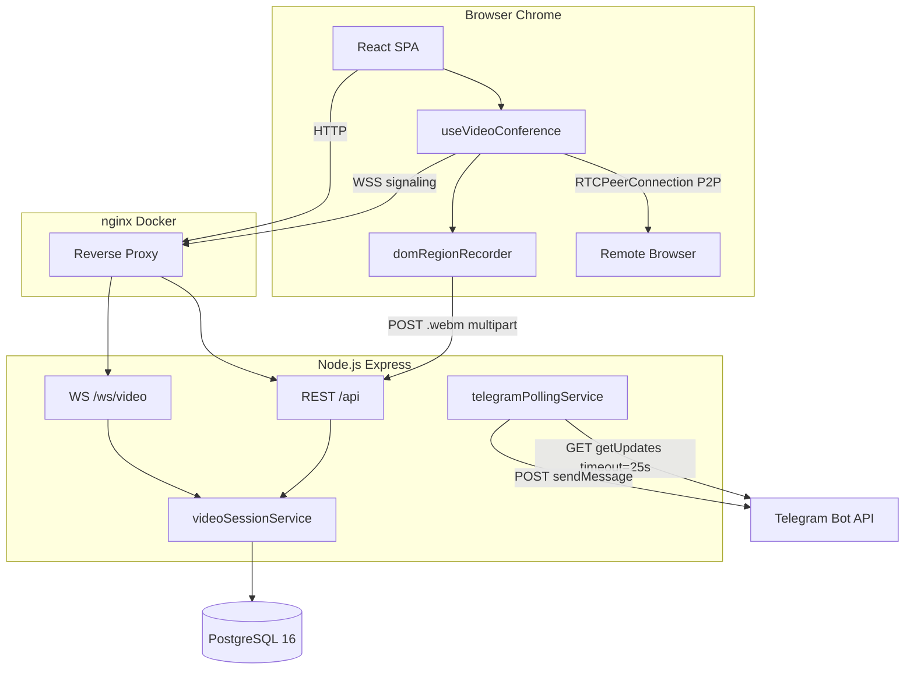

# Технологии проекта CRM Course Project

Подробное описание всех технологий, используемых в проекте: теоретическая часть, назначение и практическая реализация с указанием файлов и номеров строк.

---

## Содержание

1. [Общая архитектура](#1-общая-архитектура)
2. [Backend: Node.js и Express](#2-backend-nodejs-и-express)
3. [ORM Prisma и PostgreSQL](#3-orm-prisma-и-postgresql)
4. [Аутентификация и безопасность](#4-аутентификация-и-безопасность)
5. [Frontend: React и Vite](#5-frontend-react-и-vite)
6. [WebRTC — видеоконференции](#6-webrtc--видеоконференции)
7. [WebSocket-сигналинг](#7-websocket-сигналинг)
8. [Запись видеозвонка (Canvas + MediaRecorder)](#8-запись-видеозвонка-canvas--mediarecorder)
9. [Long Polling для Telegram Bot API](#9-long-polling-для-telegram-bot-api)
10. [Видеосессии и приглашения клиентов](#10-видеосессии-и-приглашения-клиентов)
11. [Инфраструктура: Docker, nginx, TLS](#11-инфраструктура-docker-nginx-tls)
12. [Тестирование](#12-тестирование)
13. [Сводная таблица технологий](#13-сводная-таблица-технологий)

---

## 1. Общая архитектура

### Теория

Проект построен по классической **трёхуровневой архитектуре**:

| Уровень | Роль |
|---------|------|
| **Presentation** | React SPA — UI, WebRTC в браузере |
| **Application** | Express REST API + WebSocket signaling + Telegram polling |
| **Data** | PostgreSQL через Prisma ORM |

Медиапоток видеозвонка идёт **напрямую между браузерами (P2P)** через WebRTC. Сервер участвует только в **сигналинге** (обмен SDP/ICE через WebSocket) и **хранении** метаданных/записей.

### Практика

```
Browser (React)
  ├── HTTP REST  → nginx → Express /api/*
  ├── WebSocket  → nginx → Express /ws/video
  └── WebRTC P2P → STUN → другой браузер

Express server.js
  ├── attachVideoSignaling()   — WebSocket
  ├── startTelegramPolling()   — long poll Telegram
  └── app (Express)            — REST API
```

**Точки входа:**

| Файл | Строки | Назначение |
|------|--------|------------|
| `backend/src/server.js` | 99–158 | Запуск HTTP(S), WebSocket, Prisma, Telegram |
| `backend/src/app.js` | 11–121 | Express middleware, маршруты, SPA fallback |
| `frontend/src/main.jsx` | — | React root, BrowserRouter, AuthProvider |
| `frontend/src/App.jsx` | 17–42 | Маршруты SPA |

---

## 2. Backend: Node.js и Express

### Теория

**Node.js** — серверная среда выполнения JavaScript на движке V8. Подходит для I/O-интенсивных задач (HTTP, WebSocket, polling) благодаря event loop и неблокирующим операциям.

**Express 5** — минималистичный веб-фреймворк для Node.js. Обеспечивает маршрутизацию, middleware-цепочку, обработку JSON-тела запросов.

**Зачем в проекте:** единый процесс обслуживает REST API, WebSocket-сигналинг и фоновый Telegram polling.

### Практика

**Зависимости** (`backend/package.json`, строки 32–41):

```json
"express": "^5.2.1",
"cors": "^2.8.6",
"helmet": "^8.1.0",
"dotenv": "^17.4.2",
"multer": "^2.1.1",
"ws": "^8.20.1",
"jsonwebtoken": "^9.0.3",
"bcryptjs": "^3.0.3",
"@prisma/client": "^6.19.3"
```

**MVC-паттерн:**

| Слой | Файлы | Описание |
|------|-------|----------|
| Routes | `backend/src/routes/index.js` (25–82) | Регистрация всех `/api/*` маршрутов |
| Controllers | `backend/src/controllers/*.js` | HTTP-обработчики |
| Services | `backend/src/services/*.js` | Бизнес-логика |
| Repositories | `backend/src/repositories/baseRepository.js` | Доступ к Prisma |

**Middleware-цепочка** (`backend/src/app.js`):

| Строки | Middleware | Назначение |
|--------|------------|------------|
| 19–20 | `express.static("/uploads")` | Раздача загруженных файлов |
| 22–26 | `helmet` | HTTP security headers |
| 27 | `cors` | Cross-Origin для SPA |
| 28 | `express.json()` | Парсинг JSON body |
| 30–41 | HTTPS redirect | Опциональный редирект HTTP→HTTPS |
| 43 | `authMiddleware` | JWT / legacy headers |
| 79 | `routes` | API роутер |
| 118–119 | `notFound`, `error` | 404 и централизованные ошибки |

**Factory для CRM-ресурсов** (`backend/src/routes/index.js`, 55–81): цикл по `config/resources.js` создаёт CRUD-роуты для users, clients, deals, tasks, calls, documents.

---

## 3. ORM Prisma и PostgreSQL

### Теория

**PostgreSQL** — реляционная СУБД с ACID-транзакциями, JSON-поддержкой, индексами. Хранит все сущности CRM.

**Prisma** — современный ORM для Node.js/TypeScript. Схема описывается декларативно (`schema.prisma`), клиент генерируется автоматически (`prisma generate`), миграции — через SQL или `prisma migrate`.

**Зачем в проекте:** типобезопасный доступ к БД, единая схема для User, Client, Deal, Task, Call, VideoSession и др.

### Практика

**Схема** (`backend/prisma/schema.prisma`):

| Модель | Строки | Назначение |
|--------|--------|------------|
| `User` | 10–30 | Пользователи CRM (admin/manager), telegramChatId |
| `Client` | 32–53 | Клиенты менеджера |
| `ClientContactPerson` | 56–69 | Контактные лица |
| `ClientContactPoint` | 71–87 | Каналы связи (телефон, email, telegram) |
| `Deal` | 89–107 | Сделки |
| `Task` | 119–136 | Задачи |
| `Call` | 138–152 | Звонки (в т.ч. из видеосессий) |
| `Document` | 154–168 | Документы клиентов |
| `ClientInviteToken` | 170–181 | Токены приглашения клиента |
| `VideoSession` | 183–198 | Видеоконференции |

**Два PrismaClient** (`backend/src/config/prisma.js`, 11–33):

```javascript
const prismaAdmin = new PrismaClient({ datasources: { db: { url: DATABASE_URL_ADMIN } } });
const prismaManager = new PrismaClient({ datasources: { db: { url: DATABASE_URL_MANAGER } } });
```

Позволяет разделять права доступа к БД по ролям PostgreSQL (admin vs manager).

**Docker PostgreSQL** (`deploy/docker-compose.yml`, 27–41): образ `postgres:16-alpine`, БД `crm_course`, healthcheck через `pg_isready`.

**SQL-миграции** в `backend/prisma/sql/` — ручные скрипты для video_sessions, client_contacts и т.д.

---

## 4. Аутентификация и безопасность

### Теория

**JWT (JSON Web Token)** — самодостаточный токен с подписью. Сервер выдаёт токен при логине; клиент передаёт его в заголовке `Authorization: Bearer <token>`.

**bcrypt** — алгоритм хеширования паролей с солью. Пароли никогда не хранятся в открытом виде.

**Helmet** — набор middleware для установки безопасных HTTP-заголовков (X-Content-Type-Options, CSP и др.).

### Практика

**Auth middleware** (`backend/src/middlewares/authMiddleware.js`):

| Строки | Логика |
|--------|--------|
| 10–28 | Публичные пути без JWT: login, client-invite, video join, public-hint, debug-log |
| 35–46 | Bearer JWT → `req.auth = { role, userId }` |
| 48–64 | Legacy headers `x-user-role`, `x-user-id` (для pytest) |
| 66–69 | Fallback: ADMIN userId=1 (dev) |

**Публичные API для видео** (строки 18–26):

```javascript
if (p.startsWith("/api/client-invite/")) return true;
if (/^\/api\/video-sessions\/join\/[^/]+$/.test(p)) return true;
if (/^\/api\/video-sessions\/[^/]+\/public-hint$/.test(p)) return true;
```

**Frontend** (`frontend/src/authContext.jsx`): хранение JWT в `localStorage` (`crm_auth_token`), передача в `api.js`.

**WebSocket auth** (`backend/src/signaling/videoSignaling.js`, 7–20, 88–94): JWT из query `access_token` или заголовка `Authorization`; роль MANAGER → host, без JWT + `role=guest` → client.

---

## 5. Frontend: React и Vite

### Теория

**React 19** — библиотека для построения UI на компонентах и hooks. Декларативный рендер, Virtual DOM, однонаправленный поток данных.

**Vite 8** — сборщик и dev-сервер. Быстрый HMR через native ES modules, production build через Rollup.

**React Router 7** — клиентская маршрутизация SPA без перезагрузки страницы.

**Зачем в проекте:** SPA без сторонних UI-библиотек (Redux, TanStack Query) — минимальный стек, plain CSS.

### Практика

**Зависимости** (`frontend/package.json`, 14–17):

```json
"react": "^19.2.5",
"react-dom": "^19.2.5",
"react-router-dom": "^7.14.2"
```

**Маршруты** (`frontend/src/App.jsx`, 19–41):

| Path | Компонент | Auth |
|------|-----------|------|
| `/login` | `Login` | Нет |
| `/client-invite/:token` | `ClientInvitePage` | Нет |
| `/calls/join/:guestToken` | `VideoConferenceJoinPage` | Нет |
| `/calls/video/:sessionId` | `VideoConferencePublicRedirect` | Нет |
| `/calls/video-host/:sessionId` | `VideoConferencePage` | Manager |
| `/calls/assign-recording` | `CallRecordingAssignPage` | Manager |
| `/clients`, `/deals`, … | `ResourceFrame` | Да |

**API-клиент** (`frontend/src/api.js`): обёртки `fetch` с JWT, функции `createVideoSession`, `fetchClientInvitePublic`, `uploadVideoSessionRecording`.

**Конфигурация Vite** (`frontend/vite.config.js`, 5–11): plugin React, Vitest с environment `node`.

---

## 6. WebRTC — видеоконференции

> **Самый детальный раздел.** WebRTC — стек протоколов для P2P передачи аудио/видео в реальном времени без плагинов.

### 6.1. Теория: уровни WebRTC

WebRTC работает на нескольких уровнях абстракции:

```
┌─────────────────────────────────────────────────────────┐
│  Application Layer (JavaScript API)                     │
│  getUserMedia, RTCPeerConnection, RTCSessionDescription │
├─────────────────────────────────────────────────────────┤
│  Signaling Layer (вне стандарта WebRTC)                 │
│  WebSocket: обмен SDP offer/answer и ICE candidates     │
├─────────────────────────────────────────────────────────┤
│  Session Layer (JSEP — JavaScript Session Establishment)│
│  SDP: описание медиа-кодеков, портов, направлений       │
├─────────────────────────────────────────────────────────┤
│  Transport Layer                                        │
│  ICE: поиск пути между peers (host/srflx/relay)         │
│  STUN: узнаёт публичный IP:port за NAT                  │
│  TURN: ретрансляция (в проекте НЕ используется)         │
├─────────────────────────────────────────────────────────┤
│  Media Layer                                            │
│  SRTP: шифрованная передача RTP-пакетов                 │
│  DTLS: обмен ключами шифрования                         │
│  Codecs: VP8/VP9 (video), Opus (audio)                  │
└─────────────────────────────────────────────────────────┘
```

#### Уровень 1: Захват медиа (`getUserMedia`)

Браузер запрашивает доступ к камере и микрофону. Возвращает `MediaStream` с `MediaStreamTrack[]`.

#### Уровень 2: Peer Connection (`RTCPeerConnection`)

Центральный объект WebRTC. Управляет:
- добавлением локальных треков (`addTrack`);
- генерацией SDP offer/answer;
- сбором ICE candidates;
- приёмом удалённых треков (`ontrack`).

#### Уровень 3: Signaling (SDP + ICE)

WebRTC **не определяет** протокол сигналинга. В проекте — **WebSocket**:

1. **SDP Offer** — менеджер создаёт offer, отправляет клиенту.
2. **SDP Answer** — клиент отвечает answer.
3. **ICE Candidates** — обмен сетевыми адресами для NAT traversal.

#### Уровень 4: ICE и STUN

**ICE (Interactive Connectivity Establishment)** — алгоритм выбора лучшего пути между peers.

**STUN** (`stun:stun.l.google.com:19302`) — сервер, который сообщает клиенту его публичный IP:port (тип candidate `srflx`). Достаточно для большинства домашних сетей.

**TURN** — ретранслятор для симметричного NAT / корпоративных firewall. В проекте **отсутствует** — звонок может не установиться в жёстких сетевых условиях.

#### Уровень 5: Медиа (SRTP/DTLS)

После ICE connectivity checks медиа идёт **напрямую P2P**, зашифровано DTLS-SRTP. Сервер CRM медиа **не видит и не проксирует**.

### 6.2. Практика: frontend hook

**Файл:** `frontend/src/hooks/useVideoConference.js`

#### Константы и конфигурация

| Строки | Код | Назначение |
|--------|-----|------------|
| 9 | `MAX_ROOM_PARTICIPANTS = 2` | Лимит участников |
| 10 | `STUN_SERVERS = [{ urls: "stun:stun.l.google.com:19302" }]` | ICE servers |
| 12–15 | `wsOrigin()` | HTTP→WS, HTTPS→WSS |

#### Состояние React

| Строки | State | Значения |
|--------|-------|----------|
| 24–31 | `localStream`, `remoteStream`, `participantCount`, `sessionStatus`, `error`, `micEnabled`, `cameraEnabled`, `recordingBlob` | UI и логика |
| 33–39 | refs | `wsRef`, `peerPcRef`, `remotePeerIdRef`, `recorderStopRef` |

#### Создание RTCPeerConnection

```javascript
// строки 50–110
const ensureSinglePeer = (remotePeerId, ws) => {
  const pc = new RTCPeerConnection({ iceServers: STUN_SERVERS });
  stream.getTracks().forEach((track) => pc.addTrack(track, stream));

  pc.onicecandidate = (event) => {
    ws.send(JSON.stringify({ type: "ice", to: remotePeerId, candidate: event.candidate }));
  };

  pc.ontrack = (event) => {
    // сбор remote MediaStream из incoming tracks
    setRemoteStream(new MediaStream(stream.getTracks()));
  };
};
```

**Ключевые моменты:**
- **Один** `RTCPeerConnection` на пару (не mesh) — строки 54–56;
- Локальные треки добавляются до offer — строки 61–64;
- ICE candidates отправляются через WS — строки 66–76;
- `ontrack` собирает remote stream, заменяя треки одного kind — строки 78–106.

#### WebSocket + WebRTC handshake

| Строки | Событие WS | Действие |
|--------|------------|----------|
| 188–194 | — | `getUserMedia({ video: true, audio: true })` |
| 196–203 | — | Подключение WS с `guestToken`, `peerId`, JWT или `role=guest` |
| 222–224 | `joined` | Сброс ошибки |
| 226–229 | `joined/peer-joined/peer-left` | Обновление `participantCount` |
| 231–234 | `peers` | `ensureSinglePeer(peers[0])` — уже подключённый peer |
| 236–245 | `sdp` | `setRemoteDescription` → если offer, `createAnswer` → send answer |
| 247–252 | `ice` | `addIceCandidate` |
| 254–265 | `peer-joined` | **Менеджер** создаёт offer — инициатор соединения |
| 267–276 | `peer-left` | Закрытие PC, остановка записи |

**Порядок установления соединения (типичный сценарий):**

```
1. Manager подключается к WS → joined, peers=[]
2. Client подключается к WS → joined; Manager получает peer-joined
3. Manager: createOffer → send sdp(offer) → Client
4. Client: setRemoteDescription(offer) → createAnswer → send sdp(answer) → Manager
5. Обмен ice candidates в обе стороны
6. ICE connectivity check → ontrack на обоих → P2P media flow
7. participantCount=2 → startRecordingIfReady (только manager)
```

#### Управление медиа

| Строки | Функция | Действие |
|--------|---------|----------|
| 304–311 | `toggleMic` | `track.enabled = !track.enabled` |
| 313–320 | `toggleCamera` | то же для video tracks |
| 322–331 | `stopRecording` | Остановка `domRegionRecorder`, возврат Blob |

### 6.3. Ограничения WebRTC в проекте

| Ограничение | Где задано |
|-------------|------------|
| Ровно 2 участника | `videoSessionService.js:11`, `useVideoConference.js:9` |
| Только Chrome | `docs/VIDEO_CONFERENCE.md:28` — MediaRecorder video/webm |
| STUN only, no TURN | `useVideoConference.js:10` |
| Manager = offerer | `useVideoConference.js:260–264` |

---

## 7. WebSocket-сигналинг

### Теория

**WebSocket** — полнодупlexный протокол поверх TCP. После HTTP Upgrade соединение остаётся открытым; сервер может push-сообщения клиенту без polling.

**Зачем для WebRTC:** SDP и ICE candidates нужно доставить второму peer в реальном времени. WebSocket — стандартный выбор для signaling server.

**Библиотека `ws`** (npm) — реализация WebSocket для Node.js, совместимая с браузерным API.

### Практика: сервер

**Файл:** `backend/src/signaling/videoSignaling.js`

#### Инициализация

```javascript
// строки 22–33
const wss = new WebSocketServer({ server: httpServer, path: "/ws/video" });
const roomSockets = new Map(); // sessionId → Map<peerId, WebSocket>
```

WebSocket **привязан к HTTP(S) серверу** — тот же порт, что и REST API (`server.js:105, 117, 125`).

#### Подключение клиента (строки 50–137)

| Шаг | Строки | Проверка / действие |
|-----|--------|---------------------|
| 1 | 56–69 | Парсинг URL: `guestToken` обязателен |
| 2 | 71–76 | Поиск `VideoSession` в БД, status=`active` |
| 3 | 81–86 | Лимит участников в room |
| 4 | 88–94 | JWT → host; `role=guest` → client |
| 5 | 96–105 | `videoSessionService.joinSession(..., { viaWs: true })` |
| 6 | 113 | `room.set(peerId, ws)` |
| 7 | 115–123 | Отправка `joined` |
| 8 | 125–129 | Broadcast `peer-joined` остальным |
| 9 | 131–132 | Отправка `peers` — список уже подключённых |

#### Relay сообщений (строки 139–167)

```javascript
if (msg.type === "sdp" || msg.type === "ice") {
  room.get(targetPeer).send(JSON.stringify({ ...msg, from: peerId }));
}
```

Сервер **не парсит SDP** — только пересылает JSON между peers. Это классический **Signaling Server** pattern.

#### Отключение (строки 169–182)

- Удаление peer из room;
- `videoSessionService.leaveSession`;
- Broadcast `peer-left`;
- Очистка пустой комнаты.

### Протокол сообщений WebSocket

#### Server → Client

| type | Поля | Когда |
|------|------|-------|
| `joined` | `sessionId`, `peerId`, `participantCount`, `recordingStartedAt` | После успешного join |
| `peers` | `peers[]`, `joinRole` | Список уже подключённых peer ID |
| `peer-joined` | `peerId`, `participantCount` | Broadcast при новом участнике |
| `peer-left` | `peerId`, `participantCount` | При disconnect |
| `error` | `message`, `code` (400/401/403/404/409) | Ошибки auth/room |

#### Client → Server (relay)

| type | Поля | Поведение |
|------|------|-----------|
| `sdp` | `to`, `sdp` (RTCSessionDescription) | Relay offer/answer |
| `ice` | `to`, `candidate` (RTCIceCandidate) | Relay ICE candidate |
| `leave` | — | Закрытие socket |

При relay сервер добавляет поле `from: peerId`.

### nginx proxy для WebSocket

**Файл:** `deploy/nginx/snippets/crm-locations.conf`, строки 26–38

```nginx
location /ws/video {
    proxy_pass         http://backend_api;
    proxy_http_version 1.1;
    proxy_set_header   Upgrade $http_upgrade;
    proxy_set_header   Connection "upgrade";
    proxy_read_timeout 86400s;  # 24 часа — долгие звонки
    proxy_send_timeout 86400s;
}
```

Без заголовков `Upgrade` и `Connection: upgrade` nginx не пропустит WebSocket handshake.

---

## 8. Запись видеозвонка (Canvas + MediaRecorder)

### Теория

WebRTC **не предоставляет** API записи P2P-потока на сервере. В проекте запись выполняется **на стороне менеджера** в браузере:

1. **Canvas compositor** — рисует local + remote video side-by-side (50/50).
2. **`canvas.captureStream(fps)`** — получает MediaStream из canvas.
3. **Audio tracks** — добавляются из local и remote streams.
4. **`MediaRecorder`** — кодирует в `video/webm` (VP8 + Opus).
5. **Upload** — POST multipart `.webm` на сервер.

**Проблема Chrome:** `drawImage()` со второго видимого WebRTC-`<video>` часто даёт пустой кадр. Решение — **отдельные скрытые `<video>`** на каждый track (`createDedicatedRecordVideo`, строки 96–156).

### Практика

**Файл:** `frontend/src/lib/domRegionRecorder.js`

| Строки | Функция / блок | Назначение |
|--------|----------------|------------|
| 10–13 | Константы | MIN 1280×720, 25 fps |
| 18–28 | `hasVideoFrame()` | Проверка готовности video element |
| 96–156 | `createDedicatedRecordVideo()` | Скрытый video + cloned track |
| 182–220 | `createTrackProcessorPainter()` | MediaStreamTrackProcessor (Chrome) |
| 516–675 | `startDomRegionRecorder()` | Главная функция записи |

**Pipeline записи** (`startDomRegionRecorder`, 516–675):

```
localStream + remoteStream
    ↓
createDedicatedStreamSlot (local) + createDedicatedStreamSlot (remote)
    ↓
composeFrame() каждые 40ms (25 fps)
    ↓
canvas.drawImage(localSlot) | canvas.drawImage(remoteSlot)  — 50/50
    ↓
canvas.captureStream(25) + audio tracks
    ↓
MediaRecorder(mimeType: video/webm)
    ↓
stop() → Blob(chunks)
```

**Триггер записи** (`useVideoConference.js`, 112–177):

- `canRecord=true` (только manager);
- `participantCount >= 2`;
- `remoteStream` готов;
- `waitForVideoTrackInStream` + `waitForRecordingTracks` (до 20 сек).

**Upload** (`backend/src/controllers/videoSessionController.js`, 77–111):

- Multer → `uploads/voice/video-{sessionId}-{timestamp}.webm`;
- `videoSessionService.saveRecording` → запись `recordingUrl` в БД.

**Завершение сессии** (`videoSessionService.js`, 369–417):

- `status: ended`, `endedAt`;
- Если есть `recordingUrl` → `callsService.createFromVideoSession` → запись в таблицу `calls`.

**Диагностика** (`frontend/src/lib/videoRecordLogger.js`, `POST /api/debug-log` — `routes/index.js:88–108`).

---

## 9. Long Polling для Telegram Bot API

> **Второй детальный раздел.** Long polling — единственный механизм «ожидания событий» в проекте (кроме WebSocket для видео).

### 9.1. Теория: Long Polling vs Webhook vs Short Polling

Telegram Bot API предлагает **два способа** получения updates:

| Метод | Как работает | Когда использовать |
|-------|--------------|-------------------|
| **Webhook** | Telegram POST-ит updates на ваш HTTPS URL | Production с публичным HTTPS |
| **Long Polling** | Ваш сервер держит HTTP GET `getUpdates` с `timeout=N` сек | Localhost, Docker без публичного URL |
| **Short Polling** | Частые GET без timeout | Неэффективно, не используется |

#### Long Polling на уровне HTTP

```
Client (backend)                    Telegram API
      │                                   │
      │  GET /getUpdates?offset=123       │
      │  &timeout=25                      │
      │ ─────────────────────────────────>│
      │                                   │  (ждёт до 25 сек)
      │                                   │  (новое сообщение!)
      │  200 OK { result: [update] }      │
      │ <─────────────────────────────────│
      │                                   │
      │  GET /getUpdates?offset=124       │
      │ ─────────────────────────────────>│
      │         ...                       │
```

**Long polling** — HTTP-запрос **не завершается сразу**. Сервер Telegram держит соединение открытым до `timeout` секунд или до появления update. Это эффективнее short polling: один запрос = одно «ожидание события».

#### Уровни абстракции в проекте

```
┌─────────────────────────────────────────────────────────────┐
│ Application Layer                                           │
│ telegramWebhookService.processTelegramUpdate()              │
│ — обработка /start, привязка chatId к User CRM              │
├─────────────────────────────────────────────────────────────┤
│ Polling Orchestration Layer                                 │
│ telegramPollingService.startTelegramPolling()               │
│ — setInterval + pollOnce, offset, inFlight guard            │
├─────────────────────────────────────────────────────────────┤
│ Transport Layer                                             │
│ fetch(getUpdates?offset=&timeout=25)                        │
│ — HTTP long poll к api.telegram.org                         │
├─────────────────────────────────────────────────────────────┤
│ Notification Layer (исходящие)                              │
│ telegramNotificationService → botClient.sendMessage()        │
│ — push уведомлений о задачах/сделках                        │
└─────────────────────────────────────────────────────────────┘
```

#### Конфликт Webhook vs Polling

Telegram **не позволяет** одновременно webhook и getUpdates на одном bot token. Поэтому перед стартом polling вызывается `deleteWebhook` (`telegramPollingService.js:16–27`).

### 9.2. Практика: telegramPollingService

**Файл:** `backend/src/services/telegramPollingService.js`

#### Конфигурация (строки 4–8)

| Env | Default | Назначение |
|-----|---------|------------|
| `TELEGRAM_BOT_TOKEN` | — | Токен BotFather |
| `TELEGRAM_POLLING_ENABLED` | false | Включить polling |
| `TELEGRAM_POLLING_INTERVAL_MS` | 1500 | Интервал между pollOnce |
| `TELEGRAM_POLLING_TIMEOUT_SEC` | 25 | Long poll timeout |
| `TELEGRAM_BOT_API_BASE` | api.telegram.org | API endpoint |

#### Состояние polling (строки 10–12)

```javascript
let pollingTimer = null;   // setInterval handle
let pollingOffset = 0;     // последний обработанный update_id + 1
let inFlight = false;      // защита от параллельных pollOnce
```

**Offset** — ключевой механизм Telegram: сервер возвращает только updates с `update_id >= offset`. После обработки offset увеличивается (`строка 47`).

#### pollOnce — один цикл long poll (строки 29–55)

```javascript
const qs = new URLSearchParams({
  offset: String(pollingOffset),
  timeout: String(Math.max(1, TELEGRAM_POLLING_TIMEOUT_SEC)),
  allowed_updates: JSON.stringify(["message", "edited_message"]),
});
const response = await fetch(`${buildApiUrl("getUpdates")}?${qs.toString()}`);
// ...
for (const update of updates) {
  pollingOffset = Math.max(pollingOffset, Number(update.update_id || 0) + 1);
  await processTelegramUpdate(update);
}
```

**Уровень HTTP:** запрос блокируется до 25 сек (long poll).
**Уровень приложения:** каждый update передаётся в общий обработчик.

#### startTelegramPolling (строки 57–89)

| Шаг | Строки | Действие |
|-----|--------|----------|
| 1 | 58–65 | Проверка `TELEGRAM_POLLING_ENABLED` |
| 2 | 66–71 | Проверка `TELEGRAM_BOT_TOKEN` |
| 3 | 72–77 | `deleteWebhookForPolling()` |
| 4 | 82–84 | `setInterval(pollOnce, max(700, INTERVAL_MS))` |
| 5 | 86 | Немедленный первый `pollOnce()` |

**Двойной цикл:** `setInterval` запускает новый poll каждые 1.5 сек, но `inFlight` guard (строка 30) не даёт параллельных запросов — пока один long poll активен, следующий пропускается.

#### Запуск из server.js (строки 140–151)

```javascript
const telegram = await startTelegramPolling();
if (telegram?.started) {
  console.log("[telegram] режим: long polling (getUpdates)");
}
```

Polling стартует **после** подключения к PostgreSQL.

### 9.3. Обработка updates

**Файл:** `backend/src/services/telegramWebhookService.js`

Используется **и для webhook, и для polling** — единая точка `processTelegramUpdate(update)`.

| Строки | Логика |
|--------|--------|
| 44–47 | Извлечение `message` / `edited_message`, `chatId`, `username` |
| 56–87 | `/start` → поиск User по `telegramLink` → сохранение `telegramChatId` |
| 89–93 | Любое другое сообщение → подсказка «отправьте /start» |

**Привязка аккаунта:**

1. Админ задаёт менеджеру `telegramLink` (https://t.me/username) в CRM.
2. Менеджер пишет боту `/start`.
3. Бот находит User по username → сохраняет `telegramChatId`.
4. Теперь `telegramNotificationService` может отправлять push.

### 9.4. Исходящие уведомления

**Файл:** `backend/src/services/telegramNotificationService.js`

| Функция | Строки | Триггер |
|---------|--------|---------|
| `notifyTaskCreated` | 34–47 | Создание задачи |
| `notifyDealCreated` | 49–63 | Создание сделки |
| `notifyOverdueTask` | 65–82 | Просроченная задача |

Цепочка: `notifyUser(userId, text)` → Prisma `telegramChatId` → `botClient.sendTelegramMessage`.

**Файл:** `telegram-bot/botClient.js`, строки 6–37 — POST `sendMessage` к Telegram API.

### 9.5. Альтернатива: Webhook

**Файл:** `backend/src/routes/telegramRoutes.js`, строки 24–37

```
POST /api/telegram/webhook
Header: x-telegram-bot-api-secret-token (опционально)
Body: Telegram Update JSON
```

Для production с публичным HTTPS URL. При webhook polling **должен быть выключен** (`TELEGRAM_POLLING_ENABLED=false`).

### 9.6. Важно: видеосессии НЕ используют long polling

В проекте **нет** server-push или polling для «входящего видеозвонка». Механизм приглашений — **REST + явные действия пользователя**:

| Действие | Механизм | Файл |
|----------|----------|------|
| Клиент копирует ссылку менеджеру | Статическая client-invite URL | `ClientInvitePage.jsx` |
| Менеджер вставляет ссылку | `useEffect` → `fetchClientInvitePublic` (один GET) | `ManagerIncomingVideoInvite.jsx:22–52` |
| Клиент нажимает «Войти в видеозвонок» | `POST /api/client-invite/:token/start-video` | `ClientInvitePage.jsx` |
| Менеджер принимает входящий | `POST /api/video-sessions` с `clientInviteUrl` | `ManagerIncomingVideoInvite.jsx:65–76` |

Это **request-response**, не long polling. Менеджер не получает push «звонит клиент» — он должен вставить ссылку или клиент должен открыть join URL.

---

## 10. Видеосессии и приглашения клиентов

### Теория

**VideoSession** — сущность CRM для двухстороннего видеозвонка менеджер ↔ клиент. Хранит метаданные в PostgreSQL; медиа — P2P через WebRTC.

**ClientInviteToken** — одноразовая/временная ссылка для клиента без регистрации в CRM.

### Практика

#### Модель БД (`schema.prisma`, 183–198)

```prisma
model VideoSession {
  id                  String    @id @default(uuid())
  managerId           Int
  clientId            Int
  direction           String    @default("out")  // "in" | "out"
  guestToken          String    @unique
  status              String    @default("active") // "active" | "ended"
  recordingStartedAt  DateTime?
  recordingUrl        String?
  startedAt           DateTime  @default(now())
  endedAt             DateTime?
}
```

#### In-memory slots (`videoSessionService.js`, 18–52)

```javascript
const sessionSlots = new Map(); // sessionId → { hostPeerId, clientPeerId }
const MAX_PARTICIPANTS = 2;
```

Синхронизирует WebSocket room с бизнес-правилами (кто host, кто client).

#### REST API (`videoSessionRoutes.js`, 46–55)

| Method | Path | Auth | Handler |
|--------|------|------|---------|
| GET | `/join/:guestToken` | Public | `getJoinMeta` |
| POST | `/join/:guestToken` | Optional | `joinSession` (REST, не WS) |
| POST | `/` | Manager | `createSession` |
| GET | `/:id/public-hint` | Public | `getPublicHint` |
| GET | `/:id` | Manager | `getSession` |
| POST | `/:id/end` | Manager | `endSession` |
| POST | `/:id/recording` | Manager | Upload `.webm` |

#### Поток входящего звонка (direction=in)

```
1. Manager создаёт invite-link: POST /api/clients/:id/invite-link
2. Client открывает /client-invite/:token
3. Client копирует ссылку → Manager вставляет в ManagerIncomingVideoInvite
4. Manager: POST /api/video-sessions { clientInviteUrl }
   ИЛИ Client: POST /api/client-invite/:token/start-video
5. Client: /calls/join/:guestToken
6. Manager: /calls/video-host/:sessionId
7. WebSocket + WebRTC (см. раздел 6–7)
8. Manager завершает → upload recording → endSession → Call в БД
```

#### Поток исходящего звонка (direction=out)

```
1. Manager: VideoConferenceSetupModal → выбор clientId
2. POST /api/video-sessions { clientId }
3. Manager получает guestJoinUrl → отправляет клиенту
4. Далее шаги 5–8 как выше
```

---

## 11. Инфраструктура: Docker, nginx, TLS

### Docker Compose

**Файл:** `deploy/docker-compose.yml`

| Service | Образ | Порт | Роль |
|---------|-------|------|------|
| `db` | postgres:16-alpine | internal | PostgreSQL |
| `db-bootstrap` | deploy-backend | one-shot | Миграция + seed |
| `backend` | deploy-backend (node:22-alpine) | 4000 internal | Express + WS + Telegram |
| `nginx` | nginx:1.27-alpine | 80, 443, 8088 | Reverse proxy + SPA |

Сеть: bridge `crm_net` `172.30.0.0/24`.

Backend env overrides (строки 71–80): `TRUST_PROXY=true`, `HTTPS_ENABLED=false` (TLS на nginx).

### nginx

**Файлы:** `deploy/nginx/default.conf`, `deploy/nginx/snippets/crm-locations.conf`

| Location | Proxy | Timeout |
|----------|-------|---------|
| `/api` | backend:4000 | 300s |
| `/uploads` | backend:4000 | 300s |
| `/ws/video` | backend:4000 | 86400s (WebSocket) |
| `/` | SPA static | — |

TLS: mkcert сертификаты из `certs/`.

### HTTPS (локальная разработка)

**Файл:** `backend/src/server.js`, 16–130

- `HTTPS_ENABLED=true` → HTTPS на `HTTPS_PORT` (4443);
- mkcert certs: `npm run certs:mkcert`;
- WebSocket автоматически WSS на том же сервере.

---

## 12. Тестирование

### Python (pytest)

**Зависимости:** `pytest`, `requests` (`.github/workflows/ci.yml`, 27–30)

| Файл | Scope |
|------|-------|
| `tests/test_video_sessions_api.py` | CRUD видеосессий, join 409, роли |
| `tests/test_client_invite.py` | Client invite + start-video |
| `tests/test_video_upload_recording.py` | Upload `.webm`, проверка owner |
| `tests/test_video_recording_unit.py` | Запуск Vitest domRegionRecorder |
| `tests/test_telegram_bot.py` | Webhook /start auto-link |
| `tests/test_calls_manager_restrictions.py` | RBAC менеджера на calls |
| `tests/test_ci_cd_lab11.py` | Требования CI lab |
| `tests/tests_server.py` | Структура сервера |
| `tests/test_functional_table_4_1.py` | Функциональная матрица |

**Конфиг:** `tests/config.py` — `BASE_URL`, role headers.

### JavaScript (Vitest)

**Файлы:** `frontend/src/**/*.test.js`, `*.test.jsx`

| Тест | Фокус |
|------|-------|
| `domRegionRecorder.test.js` | Canvas compositor 50/50 |
| `useVideoConference.test.js` | 2-party limits, recording gate |
| `VideoConferenceSetupModal.test.jsx` | Создание сессий |
| `appUrl.test.js`, `clientContactPoints.test.js`, … | Утилиты |

**Запуск:** `npm test` в `frontend/` или root scripts `test:video:*`.

**Пробел:** нет автоматических интеграционных тестов WebSocket/WebRTC.

---

## 13. Сводная таблица технологий

| Категория | Технология | Версия | Ключевые файлы |
|-----------|------------|--------|----------------|
| Runtime | Node.js | 20 (CI), 22 (Docker) | `server.js` |
| Web framework | Express | 5.2 | `app.js`, `routes/` |
| ORM | Prisma | 6.19 | `schema.prisma`, `config/prisma.js` |
| Database | PostgreSQL | 16 | `docker-compose.yml` |
| WebSocket | ws | 8.20 | `signaling/videoSignaling.js` |
| WebRTC | Browser APIs | — | `hooks/useVideoConference.js` |
| STUN | Google public | — | `useVideoConference.js:10` |
| Recording | Canvas + MediaRecorder | — | `lib/domRegionRecorder.js` |
| Upload | multer | 2.1 | `videoSessionRoutes.js:20–44` |
| Auth | JWT + bcrypt | — | `authMiddleware.js`, `utils/jwt.js` |
| Security | helmet, cors | — | `app.js:22–27` |
| Telegram | Bot API long poll | — | `telegramPollingService.js` |
| Telegram | Bot API webhook | — | `telegramRoutes.js` |
| Frontend | React | 19.2 | `frontend/src/` |
| Build | Vite | 8.0 | `vite.config.js` |
| Routing | react-router-dom | 7.14 | `App.jsx` |
| Proxy | nginx | 1.27 | `deploy/nginx/` |
| Containers | Docker Compose | — | `deploy/docker-compose.yml` |
| CI | GitHub Actions | — | `.github/workflows/ci.yml` |
| Tests (Python) | pytest + requests | — | `tests/` |
| Tests (JS) | Vitest + happy-dom | 3.2 | `frontend/src/*.test.js` |

---

## Диаграмма потоков данных



---

## Связанная документация

- [VIDEO_CONFERENCE.md](./VIDEO_CONFERENCE.md) — модель ссылок и ограничения
- [VIDEO_TESTS.md](./VIDEO_TESTS.md) — сценарии тестирования видео
- [DEPLOY_DOCKER.md](./DEPLOY_DOCKER.md) — развёртывание Docker, Telegram polling в compose
